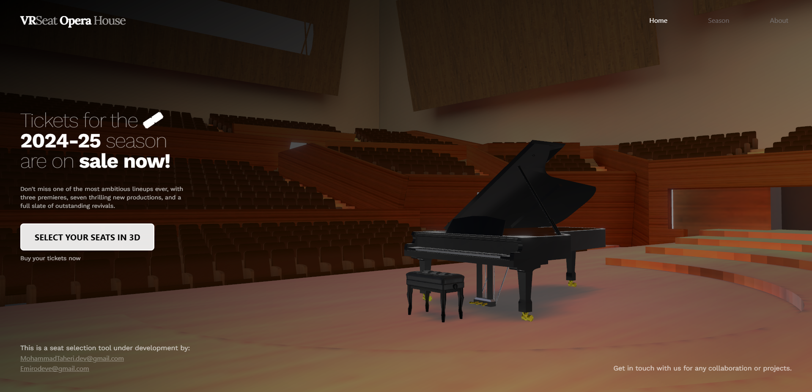
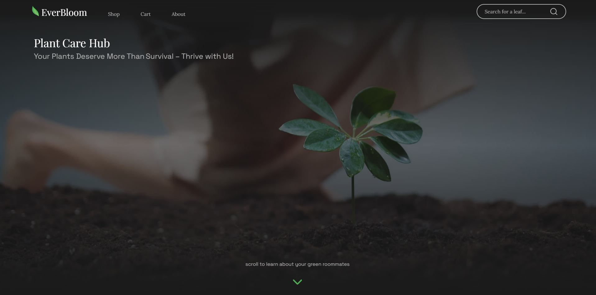
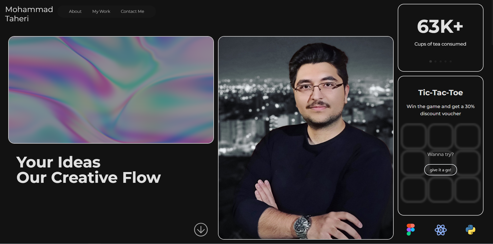
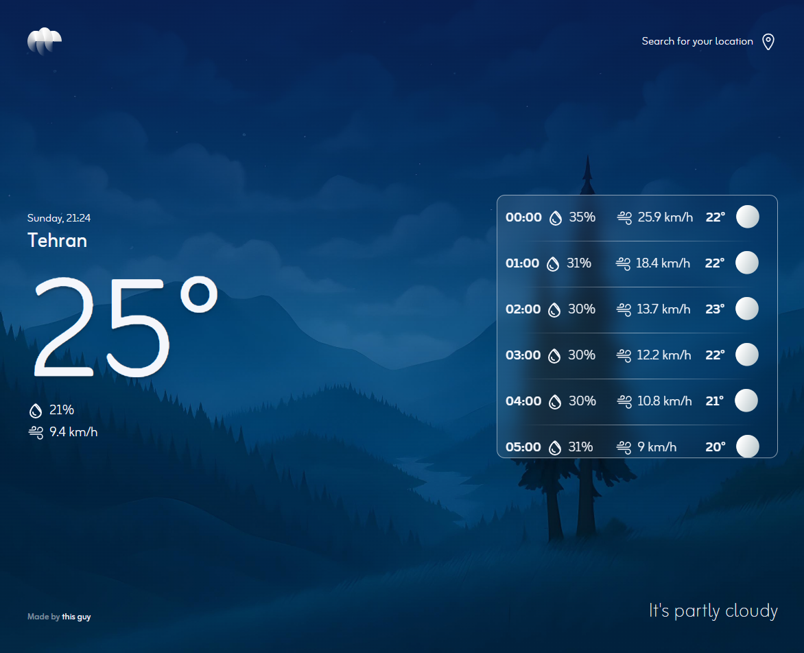

https://go.mrkkc.ir/sub/YmVnYWVpLDE3NTU3OTEzNjEROK5T9kBjs

<h1 align="center">Hey there, I'm Mohammad Taheri! 👋</h1>

  

  
  
  
  
  

  
  
  

---

## 🧑‍💻 About Me

- 🎨 **I bring ideas to life on the web!**
- 💼 Freelancer & Co-founder at **PROLLET** (Crypto Arbitrage Platform)
- 🌱 Always learning the latest in frontend, 3D, and UX
- 🗺️ Based in Mashhad, Iran, working globally

---

## 🛠️ Tech Stack

  

---

## 🚩 Featured Projects

### 🎟️ [VRSeat](https://3d-concert-hall.vercel.app/)

  <b>Immersive 3D Concert Hall Experience</b> 
  

- **Role:** Lead Frontend Developer & 3D UX Designer  
- **Tech:** Next.js, Three.js, React, Tailwind CSS  
- **What makes it cool:**  
  - Interactive 3D seat selection lets users explore and pick their favorite spot as if they are inside a real concert hall.
  - Smooth, cinematic transitions and custom 3D animations deliver a unique and engaging experience.
  - Fully responsive and touch-friendly, so you can enjoy it on any device.
  - Custom lighting and immersive visual effects.
- **Challenge:** Bringing real concert vibes to your browser 🏟️

---

### 🪴 [Everbloom](https://everbloom-mt.vercel.app/)

  <b>Modern E-commerce for Apartment Plants</b> 
  

- **Role:** Full-stack Developer  
- **Tech:** Next.js, Tailwind CSS, TypeScript  
- **What makes it cool:**  
  - Real-time search and advanced filtering for discovering the perfect plant.
  - Minimal, user-friendly UI designed for smooth shopping and browsing.
  - Custom cart logic and a seamless checkout experience.
  - Built to be mobile-first, fast, and fun to use.
- **Fun fact:** Designed to help plant-lovers discover greenery for any home 🌱

---

### 🧑‍💼 [Personal Portfolio](https://m-taheri.vercel.app/)

  <b>Your Window Into My Work</b> 
  

- **Role:** Designer & Developer  
- **Tech:** Next.js, Tailwind CSS, Framer Motion  
- **What makes it cool:**  
  - Interactive showcases, smooth scrolls, and lively animations—built to catch the eye.
  - Custom-built components to express my brand and personality.
  - SEO-optimized to shine on searches and reach recruiters and clients.
- **Behind the scenes:** Every animation and section hand-crafted!

---

### ☀️ [Solo Weather](https://solo-weather.vercel.app/)

  <b>Simple Weather App, Simply Beautiful</b> 
  

- **Role:** Frontend Developer  
- **Tech:** React, OpenWeatherMap API, Tailwind CSS  
- **What makes it cool:**  
  - Clean, minimal design and a focus on speed.
  - Get up-to-date weather info by location, at a glance.
  - Great as a quick reference for daily weather—plus, the UI is super chill!
- **Why I built it:** For fun and to practice using APIs on the frontend! ⛅

---

## 🎓 Education

**BSc in Computer Engineering**  
Azad University – Mashhad, Iran (2017–2021)  
- Graduated with a high GPA  
- Internships in web and backend development

---

## 🏆 Certifications & Achievements

- 🐍 **Python Programming Certification** – Technical and Vocational Training Organization of Iran (2024)
- 🚀 Improved app load times by **25%** through efficient frontend architectures
- 📈 Boosted SEO and performance scores by **30%**
- 💼 Helped clients increase leads by **25%** with better portfolio and CRM sites

---

## 🎉 Did You Know?

  🍕 I love code, coffee, and pizza in equal measure  
  🎮 Big fan of indie games and 3D web experiments  
  🐱 Cat person. My code reviews are powered by purrs!

---

## 📫 Let's Connect!

  <a href="https://taheri.vercel.app/">Portfolio Website</a> • 
  <a href="https://www.linkedin.com/in/mohammad-taheri-6b5ba0241">LinkedIn</a> • 
  <a href="mailto:Mohammadtaheri.dev@gmail.com">Email Me</a>

---

“Great things are not done by impulse, but by a series of small things brought together.” — Vincent Van Gogh

